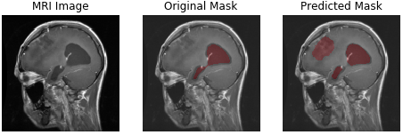

# Brain tumor segmentation in MRI images using U-Net, U-Net and Attention U-Net with Transfer Learning Approach

Brain tumour segmentation is one of the most crucial and challenging tasks in the field of medical image processing as human-assisted manual classification can lead to accurate prediction and diagnosis. Moreover, it becomes a tedious task when there is a large amount of data present to process manually. Brain tumours have diversified appearance and there is a similarity between tumour and normal tissue and therefore there extraction of tumour regions from images becomes complicated. 
In this master work, we developed models to extract brain tumour from 2D magnetic resonance (MRI) brain images by algorithms and deep learning methods, based on different approaches developed for semantic image segmentation in the Biomedical field.

Here, I have implemented a diffents architectures U-Net, U-Net++ and Attention U-Net  to segment tumor in MRI images of brain.

There are 3 types of brain tumor:
1. meningioma
2. glioma
3. pituitary tumor

## Examples of predicted tumor segment by the current U-Net implementation.
meningioma       	  | glioma		| 	pituitary tumor             
:-------------------------:|:-------------------------:|:------------------------:
  |  		| 
  |  		|  
  |  		|  

## Getting Started
Here I will explain how to get the data and convert it into the usable form. You can run the train and run model using [notebook](https://github.com/adityajn105/brain-tumor-segmentation-unet/blob/master/brain-tumor-segmentation.ipynb).

### Prerequisites
You will need Python 3.X.X with some packages which you can install direclty using requirements.txt.
> pip install -r requirements.txt

### Get the Dataset
I have used brain-tumor segment dataset which is available on the internet. You can run [download_data.sh](https://github.com/adityajn105/brain-tumor-segmentation-unet/blob/master/download_data.sh) shell script to download all data. It contains 3064 MRI images and 3064 masks. 
> bash tumor-segmentation-unet/download_data.sh

After that run the following command to convert data in useable form.
> python tumor-segmentation-unet/mat_to_numpy.py brain_tumor_dataset/ 

## Model Architecture
I have used combination of multiple losses which includes binary crossentropy, dice loss with equal weightage. Also I have used Conv2D transpose layers for upsampling. 

I have used the metric called IOU (Intersection over Union) metric to track progress of training and trained Unet with Adam optimizer for 40-60 epochs with decaying learning rate between 1e-3 to 1e-4. I have also performed only one Image augmentation i.e. horizontal flip. Train and test split was stratified using type of tumor.

## Supervised By :
* Mr Professor  : EL QADI ABDERRAHIM

## Authors:
* Mr. EL BOUZIDI ZAHR-EDDINE : [LinkedIn](https://www.linkedin.com/in/zahr-eddine-el-bouzidi-7b4366a5/)  : elbouzidi.zahreddine@moroccoresearchers.com
* Mr. GUIIDAT AHMED-AMINE : [LinkedIn](https://www.linkedin.com/in/guiidat/) :  amine.guiidat@moroccoresearchers.com
## Website :
https://moroccoresearchers.com/

## To Read:
1. [U-Net: Convolutional Networks for Biomedical Image Segmentation](https://arxiv.org/pdf/1505.04597.pdf)
2. [Image Segmentation, ConvNet, FCN, Unet](https://towardsdatascience.com/understanding-semantic-segmentation-with-unet-6be4f42d4b47)
3. [Up-sampling with Transposed Convolution](https://towardsdatascience.com/up-sampling-with-transposed-convolution-9ae4f2df52d0)
4. [Lovasz Loss](https://arxiv.org/abs/1705.08790) 
5. [Jaccard Index - Intesection over Union](https://www.jeremyjordan.me/evaluating-image-segmentation-models/)
6. [Understanding Dice Loss](https://forums.fast.ai/t/understanding-the-dice-coefficient/5838)
7. [Another Image Segmentation Problem](https://github.com/adityajn105/TGS-Salt-Identification-Image-Segmentation-)

## ملخص:
يناقش هذا العمل دور الذكاء الاصطناعي في مجال تطوير معالجة الصور الطبية بشكل يسهل على الأطباء الحصول على تشخيص للأورام الأكثر تعقيدا بشكل دقيق، انطلاقا من معطيات وتشخيصات سابقة لكل أنواع الأورام التي تمت دراستها وتحليلها من طرف الأخصائيين. ويعد تجزئة ورم الدماغ أحد المهام الأكثر حيوية وتحديًا في مجال معالجة الصور الطبية، حيث يمكن أن يؤدي التصنيف اليدوي بمساعدة الإنسان إلى التنبؤ والتشخيص الدقيقين. علاوة على ذلك، تصبح مهمة شاقة عندما يكون هناك قدر كبير من البيانات الموجودة للمعالجة يدويًا. إن أورام المخ لها مظهر متنوع ويوجد تشابه بين الورم والأنسجة الطبيعية وبالتالي يصبح استخراج مناطق الورم من الصور معقدًا. ولهذا قد توفر التكنولوجيا الحديثة حلا أكثر دقة من خلال نظام يمكن من تحسين نتائج التشخيص للأورام الثانوية المعقدة.
في هذا البحث العلمي، قمنا بتطوير نماذج لاستخراج ورم في الدماغ انطلاقا من صور الدماغ المأخوذة بواسطة الرنين المغناطيسي ثنائي الأبعاد (MRI) عن طريق الخوارزميات وطرق التعلم العميق ودلك باعتماد على تقنية نقل التعلم باستخدام نمادج مدربة سابقا VGG16  و EfficientNetB0 ، وبناءً على مختلف الأساليب التي تم تطويرها لتجزئة الصور الدلالية في مجال الطب الحيوي. لقد تم تطبيق ثلاثة مناهج محسّنة لـ CNN في الطب الحيوي، وهي U-Net ++ U-Net++  و Attention U-Net الذي يظهر تحسنًا في الأداء مقارنة بالمصنفات التقليدية. تم أيضًا مقارنة النتائج الثلاثة من حيث تجزئة الصور الطبية الحيوية بٌغية الحصول على أفضل نموذج بدقة جيدة.

يعد هذا المشروع تتويجا لمجهودات البحث بالسنة الأخيرة من سلك الماستر المتخصص، ويندرج هذا العمل في إطار مشروع نظام التوصية الذي هو نظام خدمة معلومات يربط بين الأطباء والتشخيص، حيث من ناحية؛ هذا المشروع يساعد الأطباء على اكتشاف العلاجات المناسبة ووضع تشخيصات دقيقة للمرض؛ ومن ناحية أخرى، فإنه يسهل التعرف على كل الحالات السابقة للمرض ويسهل أخد القرار من طرف الطبيب المعالج. إن نظام التوصية هو نظام قوي يمكن أن يضيف قيمة كبيرة في مجال الطب الحيوي. في حالة عدم وجود تشخيص أولي في جدول التشخيصات، فإن النظام على دمجه في قاعدة البيانات بصفة تلقائية من أجل تقديم صورة كاملة للطبيب بخصوص التشخيص المطلوب.

## الكلمات المفتاحية : الذكاء الاصطناعي ، معالجة الصور ، تشخيص الأورام ،الرنين المغناطيسي ثنائي الأبعاد ،نقل التعلم ،نظام التوصية,التعلّم العميق
## MRI , VGG16 ,EfficientNetB0 
## CNN, U-Net Attention U-Net, U-Net ++

